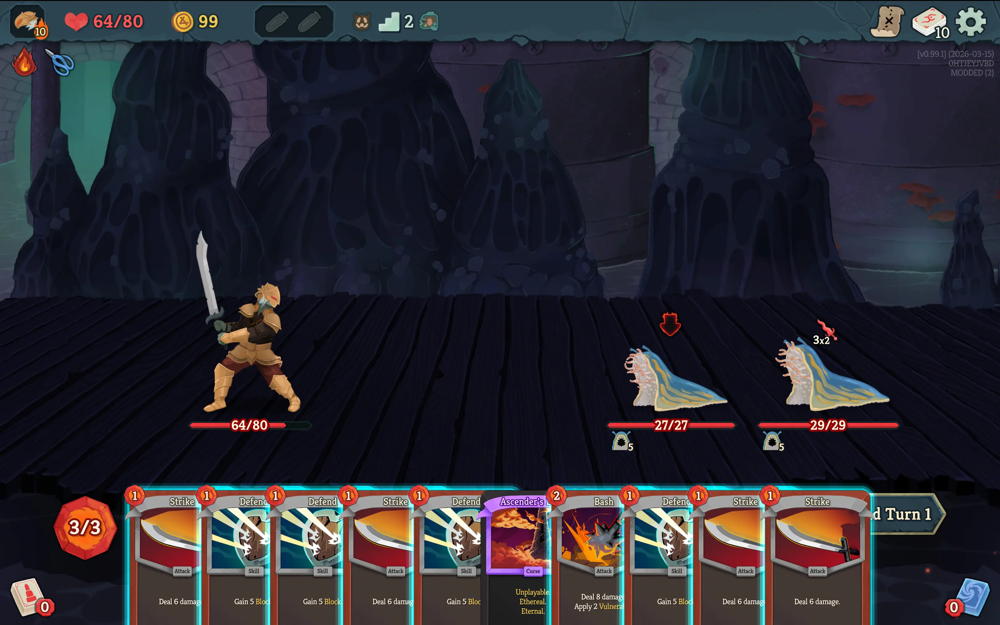

  <h1>Raise Hand</h1>
    
A Slay the Spire 2 Mod

Raises the hand up and removes all rotation so that you can read the text on cards in your hand more easily.

## Installation

1. Download the `.zip` from the latest release
    - If you are on the public beta, make sure to download a release ending with -beta.
2. Unpack the `.zip` into your Slay the Spire 2 mods folder
    - windows: `C:\Program Files (x86)\Steam\steamapps\common\Slay the Spire 2\mods`
    - linux: `~/.local/share/Steam/steamapps/common/Slay the Spire 2/mods`
3. Make sure you have the correct version of [BaseLib](https://github.com/Alchyr/BaseLib-StS2) installed as well
    - This will also differ if you are on the beta

